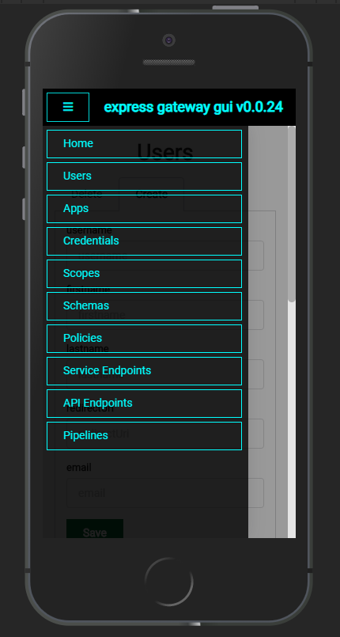

# express-gateway-gui

[](https://lerna.js.org/)

<p align="center"> 
    
</p>

This is a simple GUI for [https://www.express-gateway.io/](https://www.express-gateway.io/).
The repository is under **active** development and the project at its earliest phase, so expect:

- Wild git commits
- Almost no docs
- Expect things to break

A this time the following admin sections are implemented:

- [x] Users
- [x] Apps
- [ ] Credentials
- [ ] Scopes
- [ ] Schemas
- [ ] Policies
- [ ] Service Endpoints
- [ ] API Endpoints
- [ ] Pipeline

## Usage with docker (baked)
1. Run express-gateway as usual
1. ``docker pull ggcaponetto/express-gateway-gui``
1. ``docker run -e EXPRESS_GATEWAY_ADMIN_URL=http://host.docker.internal:9876 -e PROXY_PORT=9877 -d -p 5000:5000 -p 9877:9877 -it ggcaponetto/express-gateway-gui``

Supposing that the admin http server is listening on `` 127.0.0.1:9876``, you need to set `EXPRESS_GATEWAY_ADMIN_URL`
to this address, reachable from within a docker container (On Windows: Use ``host.docker.internal`` to access the host.).

1. Open the GUI [http://localhost:5000](http://localhost:5000)

## Usage with docker (build it yourself)

1. Build the container

``docker build --build-arg REACT_APP_PROXY_URL=http://localhost:9877 -t express-gateway-gui . ``

1. Run the container

``docker run -e EXPRESS_GATEWAY_ADMIN_URL=http://host.docker.internal:9876 -e PROXY_PORT=9877 -d -p 5000:5000 -p 9877:9877 -it express-gateway-gui``

## Contribution guide

1. ```npm i```
1. ``lerna bootstrap``
1. ``lerna build``
1. ``lerna start-dev``
